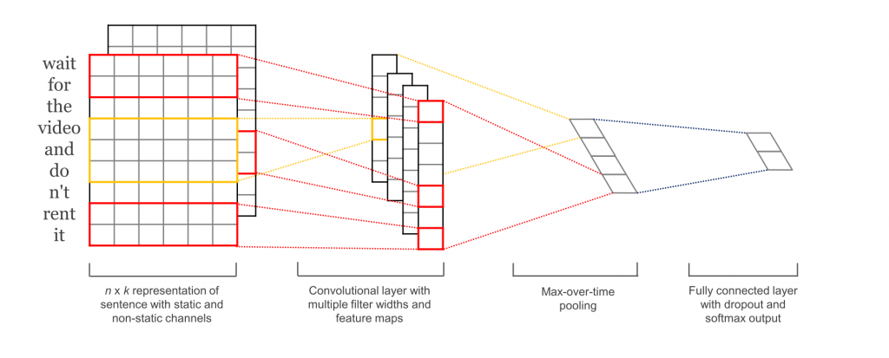
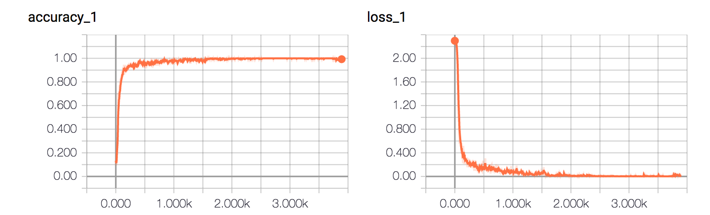

# Text Classification with CNN

使用卷积神经网络进行文本分类

CNN做句子分类的论文可以参看: [Convolutional Neural Networks for Sentence Classification](https://arxiv.org/abs/1408.5882)

还可以去读dennybritz大牛的博客：[Implementing a CNN for Text Classification in TensorFlow](http://www.wildml.com/2015/12/implementing-a-cnn-for-text-classification-in-tensorflow/)

本文是基于TensorFlow在中文数据集上的另一种实现，如果你觉得对你有帮助，欢迎star与交流。

## 环境

- Python 3.5
- TensorFlow 1.3

## 数据集
法律数据集

类别如下：

```
婚姻家庭 ..........
```

数据集划分如下：(n为总数）

- 训练集: 90%n
- 验证集: 10%n
- 测试集: 10%n

从excel读入数据 自动划分百分之10%作为训练集 验证集
## 预处理

`data/xlxs_loader.py`为数据的预处理文件。

- `read_file()`：读取上一部分生成的数据文件，将内容和标签分开返回;
- `_build_vocab()`: 构建词汇表，这里不需要对文档进行分词，单字的效果已经很好，这一函数会将词汇表存储下来，避免每一次重复处理;
- `_read_vocab()`: 读取上一步存储的词汇表，转换为`{词：id}`表示;
- `_read_category()`: 将分类目录固定，转换为`{类别: id}`表示;
- `_file_to_ids()`: 基于上面定义的函数，将数据集从文字转换为id表示;
- `to_words()`: 将一条由id表示的数据重新转换为文字;
- `preocess_file()`: 一次性处理所有的数据并返回;
- `batch_iter()`: 为神经网络的训练准备批次的数据。


## 配置项

可配置的参数如下所示，在`model.py`的上部。

```
class TCNNConfig(object):
    """配置参数"""

    # 模型参数
    embedding_dim = 64      # 词向量维度
    seq_length = 600        # 序列长度
    num_classes = 16        # 类别数
    num_filters = 256       # 卷积核数目
    kernel_size = 5         # 卷积核尺寸
    vocab_size = 5000       # 词汇表达小

    hidden_dim = 128        # 全链接层神经元

    dropout_keep_prob = 0.8 # dropout保留比例
    learning_rate = 1e-3    # 学习率

    batch_size = 128         # 每批训练大小
    num_epochs = 10          # 总迭代轮次
```

## 模型

原始的模型如下图所示：



可看到它使用了多个不同宽度的卷积核然后将它们做了一个max over time pooling转换为一个长的特征向量，再使用softmax进行分类。

实验发现，简单的cnn也能达到较好的效果。

因此在这里使用的是简化版的结构，具体参看`model.py`。

首先在初始化时，需要定义两个`placeholder`作为输入输出占位符。

```
def __init__(self, config):
      self.config = config

      self.input_x = tf.placeholder(tf.int32,
          [None, self.config.seq_length], name='input_x')
      self.input_y = tf.placeholder(tf.float32,
          [None, self.config.num_classes], name='input_y')

      self.cnn()
```

词嵌入将词的id映射为词向量表示，embedding层会在训练时更新。

```
def input_embedding(self):
    """词嵌入"""
    with tf.device('/cpu:0'):
        embedding = tf.get_variable('embedding',
            [self.config.vocab_size, self.config.embedding_dim])
        _inputs = tf.nn.embedding_lookup(embedding, self.input_x)
    return _inputs
```

cnn模型中，首先定义一个一维卷积层，再使用`tf.reduce_max`实现global max pooling。再接两个dense层分别做映射和分类。使用交叉熵损失函数，Adam优化器，并且计算准确率。这里有许多参数可调，大部分可以通过调整TCNNConfig类即可。

```
def cnn(self):
      """cnnc模型"""
      embedding_inputs = self.input_embedding()

      with tf.name_scope("cnn"):
          # cnn 与全局最大池化
          conv = tf.layers.conv1d(embedding_inputs,
              self.config.num_filters,
              self.config.kernel_size, name='conv')

          # global max pooling
          gmp = tf.reduce_max(conv, reduction_indices=[1], name='gmp')

      with tf.name_scope("score"):
          # 全连接层，后面接dropout以及relu激活
          fc = tf.layers.dense(gmp, self.config.hidden_dim, name='fc1')
          fc = tf.contrib.layers.dropout(fc,
              self.config.dropout_keep_prob)
          fc = tf.nn.relu(fc)

          # 分类器
          self.logits = tf.layers.dense(fc, self.config.num_classes,
              name='fc2')
          self.pred_y = tf.nn.softmax(self.logits)

      with tf.name_scope("loss"):
          # 损失函数，交叉熵
          cross_entropy = tf.nn.softmax_cross_entropy_with_logits(
              logits=self.logits, labels=self.input_y)
          self.loss = tf.reduce_mean(cross_entropy)

      with tf.name_scope("optimize"):
          # 优化器
          optimizer = tf.train.AdamOptimizer(
              learning_rate=self.config.learning_rate)
          self.optim = optimizer.minimize(self.loss)

      with tf.name_scope("accuracy"):
          # 准确率
          correct_pred = tf.equal(tf.argmax(self.input_y, 1),
              tf.argmax(self.pred_y, 1))
          self.acc = tf.reduce_mean(tf.cast(correct_pred, tf.float32))
```

## 训练与验证

这一部分详见代码，具体不在此叙述。

在设定迭代轮次为10的时候，测试集达到了89%的准确率，可见效果还是很理想的。


准确率和误差如图所示：




## RNN

RNN模型，在100轮迭代后，得到了85%的准确率，且速度相对CNN要慢很多。

